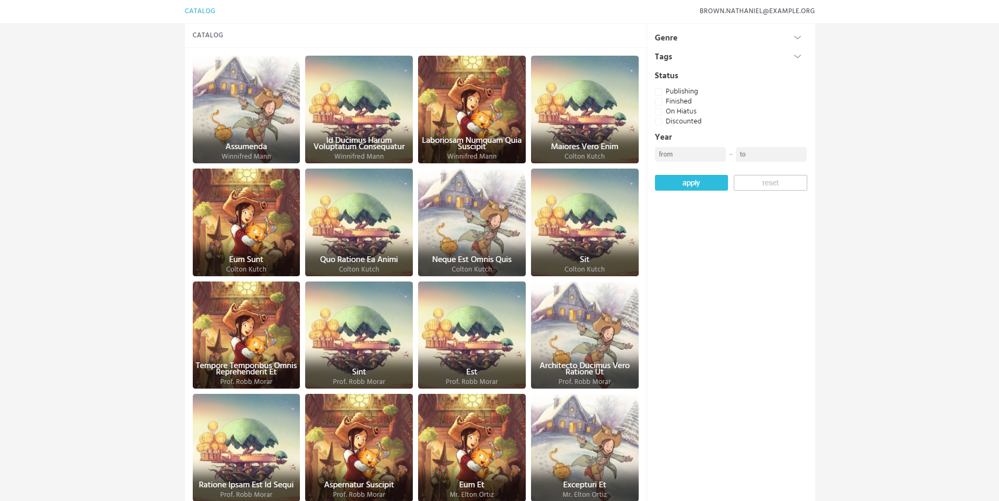
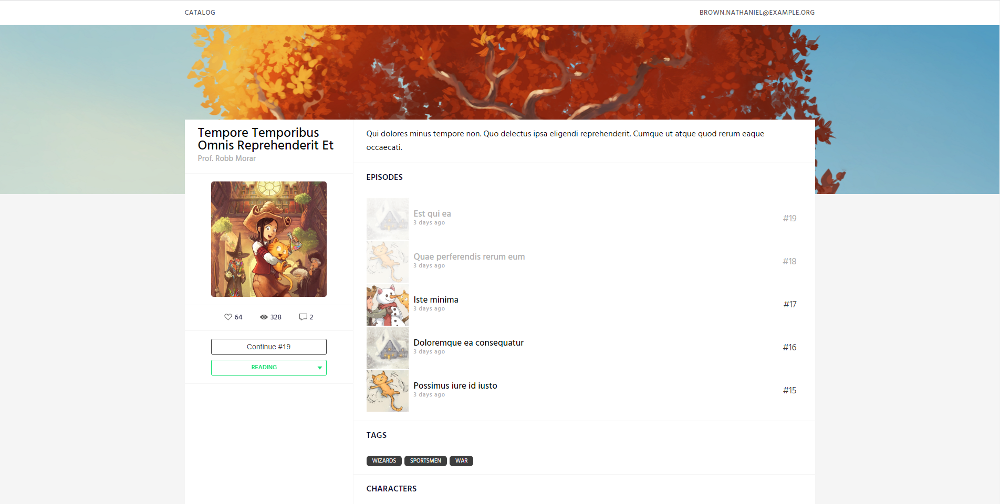
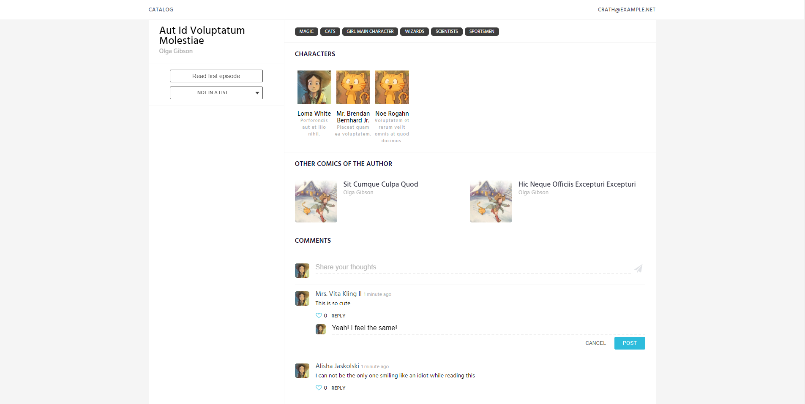

### Vue 3(+TypeScipt) + Laravel 9
> Laratoon это вертикальный срез (он не является полнофункциональным приложением, лишь минимально реализует самые основные возможности) веб-сайта для чтения онлайн комиксов, который я написал в свободное время, чтобы опробовать возможности `Vue 3` и `TypeScript`.

Иллюстрации взяты из open-source веб-комикса "Papper&Carrot" за авторством Дэвида Ревуа.

## Как поднять:

Предполагается, что вы используете Windows, у вас локально установлены Git, PHP совместимой версии (от 8.0.2), Composer и MySQL (8.0).
Также есть вариант с Laravel Sail, но я его не использую, потому что файловая система WSL слишком медленная.

- Откройте MySql 8.0 Command Line Client, пройдите аутентификацию и введите:
```sql
CREATE DATABASE laratoon;
CREATE USER 'laravel'@'localhost' IDENTIFIED BY 'laravel';
GRANT ALL PRIVILEGES ON laratoon.* TO 'laravel'@'localhost';
```

- Откройте терминал в папке, куда хотите поместить проект, выделите разом все следующие команды и вставьте их в терминал щелчком по правой кнопке мыши:
```bash
git clone https://github.com/IgorLockyh/laratoon_backend.git
cd laratoon_backend
copy .env.example .env
composer install
php artisan key:generate
php artisan migrate --seed
php artisan serve
php -r "echo 'Hello world!';"
```

- Откройте веб-браузер, и введите [http://127.0.0.1:8000/](http://127.0.0.1:8000/) в адресную строку - откроется поднявшийся сайт.

## Скриншоты
Каталог

Страница комикса

Комментарии на странице комикса

